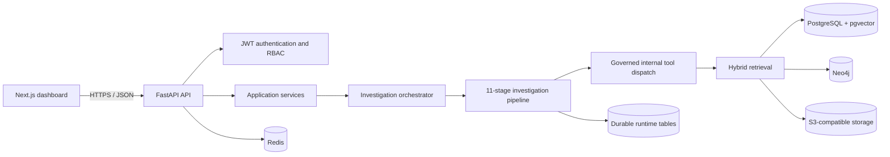
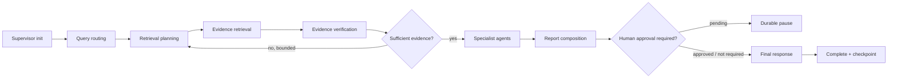

<div align="center">

# Mnemos

### Industrial knowledge intelligence built around the asset

Evidence-grounded operational memory for maintenance, reliability, safety, quality, and compliance teams.

[](.github/workflows/backend-ci.yml)
[](frontend)
[](src/mnemos)
[](pyproject.toml)
[](#license)

</div>

---

## What Mnemos does

Industrial knowledge is rarely missing; it is fragmented. OEM manuals, work orders, inspection records, procedures, shift logs, compliance evidence, and expert observations often live in different systems with different identifiers and revision histories.

Mnemos organises that information around physical assets and their operational timelines. It combines a multi-tenant FastAPI backend, hybrid retrieval, a governed multi-agent investigation workflow, durable runtime persistence, and a Next.js operational dashboard.

The platform is designed to answer questions such as:

- What evidence supports the suspected cause of a recurring failure?
- Which current procedure applies to this asset configuration?
- Where are compliance requirements missing valid evidence?
- Has this failure pattern appeared on related assets?
- What is known, contradicted, stale, or still missing?

Mnemos is not a replacement for a CMMS, EAM, QMS, or document-management system. It is an evidence and reasoning layer that connects those records into an asset-centred operational memory.

## Product surfaces

| Surface | Purpose |
|---|---|
| Plant overview | Operational KPIs, high-risk assets, evidence gaps, and recent activity |
| Asset passport | Timeline, supporting evidence, claims, missing evidence, graph context, and recommended actions |
| Investigation workspace | RCA timeline, hypotheses, supporting/opposing evidence, diagnostics, and actions |
| Compliance matrix | Requirement-to-asset evidence mapping, validity, gaps, and review status |
| Knowledge graph | Interactive asset, finding, document, procedure, and expert-knowledge relationships |
| Documents | Version-aware source library and evidence viewing |
| Expert knowledge | Attributed, reviewable operational knowledge cards |
| Query workspace | Natural-language investigation entry point and evidence-backed result display |
| Agentic trace | Stage-by-stage execution visibility, timing, evidence, and missing-information disclosure |
| Results | Searchable completed analyses with confidence and citations |
| Organisation | Authenticated workspace, membership, account, and destructive-action controls |

The dashboard includes a public read-only demonstration dataset. Authentication is required for private workspace data and mutating operations.

## Architecture



### Investigation pipeline



The reflection loop is bounded. Critical decisions are not silently auto-approved. Runtime checkpoints, audit entries, investigation events, approval requests, and idempotency markers are persisted in PostgreSQL.

## Evidence and retrieval model

Mnemos combines multiple retrieval strategies rather than treating every question as flat vector search:

1. **Vector retrieval** through pgvector for semantic similarity.
2. **Lexical retrieval** for exact industrial terms, tags, part numbers, and procedure identifiers.
3. **Structured retrieval** for temporal, numeric, and status filters.
4. **Graph retrieval** for asset, component, event, evidence, and failure relationships.
5. **Multi-hop retrieval** for indirect operational relationships.
6. **Reranking and deduplication** before evidence reaches reasoning agents.
7. **Provenance verification, contradiction detection, and confidence scoring** before report composition.

Every material claim is expected to carry source provenance. When the available evidence is insufficient, the workflow should identify missing evidence or abstain instead of fabricating certainty.

## Governed agent execution

The agentic layer uses specialised retrieval and reasoning agents with:

- intent-selective dispatch;
- per-agent tool allowlists;
- tenant, site, asset, and document scope propagation;
- bounded tool-call budgets and timeouts;
- structured tool trajectories;
- scope-violation and duplicate-call evaluation;
- approval gates for governed decisions;
- durable checkpoint and resume behaviour.

The package named `agentic/mcp` is an **internal governed tool-dispatch layer**. It does not claim protocol-level compatibility with the external Model Context Protocol specification.

## Repository layout

```text
.
├── frontend/                       # Next.js 15 dashboard and server-side API proxy
├── src/mnemos/
│   ├── agentic/
│   │   ├── agents/                 # Retrieval and specialist reasoning agents
│   │   ├── evaluation/             # Deterministic evaluation and regression gates
│   │   ├── graph/                  # Graph interfaces and Neo4j integration
│   │   ├── mcp/                    # Governed internal tool dispatch
│   │   ├── retrieval/              # Hybrid retrieval, reranking, citation handling
│   │   ├── runtime/                # Pipeline, approvals, durability, idempotency, OTel
│   │   └── services/               # LLM and resource services
│   ├── api/                        # FastAPI route modules and dependencies
│   ├── core/                       # Configuration, DB, middleware, logging, security
│   ├── integrations/               # Agent and ingestion gateway adapters
│   ├── models/                     # SQLAlchemy entities and vector models
│   ├── schemas/                    # API contracts
│   └── services/                   # Application services and query persistence
├── alembic/                        # Database migrations
├── scripts/                        # Entrypoints, seed and operational utilities
├── tests/                          # Project-level regression and contract tests
├── docs/                           # Architecture, security, operations and testing docs
├── Dockerfile
├── docker-compose.yml
├── docker-compose.production.yml
├── render.yaml
└── pyproject.toml
```

## Technology stack

| Area | Current implementation |
|---|---|
| Frontend | Next.js 15, React 19, Tailwind CSS 3 |
| API | FastAPI, Pydantic v2, ORJSON |
| Persistence | SQLAlchemy 2 async, PostgreSQL, Alembic |
| Vector search | pgvector |
| Graph | Neo4j / Aura-compatible driver |
| Cache and rate limiting | Redis |
| Object storage | S3-compatible API |
| Agent orchestration | LangGraph-based canonical runtime |
| LLM integration | Configurable OpenAI-compatible provider layer and model router |
| Observability | Structured JSON logging and OpenTelemetry hooks |
| Testing | pytest, pytest-asyncio, Ruff, deterministic evaluation gates |
| Deployment | Docker, managed-container API profile, serverless-compatible frontend |

## Local development

### Prerequisites

- Python 3.12
- Node.js 20+
- Docker Desktop with Docker Compose
- Git

### 1. Configure the environment

```bash
cp .env.example .env
cp frontend/.env.example frontend/.env.local
```

Use development credentials only. Never commit `.env`, `.env.local`, provider keys, database URLs, or exported production data.

### 2. Start infrastructure

```bash
docker compose up -d postgres redis minio neo4j
```

Neo4j can be disabled locally with `NEO4J_ENABLED=false` when graph retrieval is not under test.

### 3. Backend

```bash
python -m venv .venv
```

Windows Command Prompt:

```cmd
call .venv\Scripts\activate.bat
python -m pip install --upgrade pip setuptools wheel
python -m pip install -e ".[dev]"
alembic upgrade head
python -m uvicorn mnemos.main:app --host 0.0.0.0 --port 8000 --reload
```

macOS / Linux:

```bash
source .venv/bin/activate
python -m pip install --upgrade pip setuptools wheel
python -m pip install -e '.[dev]'
alembic upgrade head
python -m uvicorn mnemos.main:app --host 0.0.0.0 --port 8000 --reload
```

### 4. Frontend

```bash
cd frontend
npm ci
npm run dev
```

Default local endpoints:

| Service | URL |
|---|---|
| Frontend | `http://localhost:3000` |
| API liveness | `http://localhost:8000/health/live` |
| API docs in development | `http://localhost:8000/docs` |
| Neo4j browser | `http://localhost:7474` |
| MinIO console | `http://localhost:9001` |

### 5. Demonstration data

```bash
python scripts/seed.py
```

Set `SEED_DEFAULT_PASSWORD` locally before running the seed command. Do not use a production password.

## Quality checks

Focused checks are preferred during development; the full suite runs in CI.

```cmd
python -m ruff check src tests scripts
python -m compileall -q src tests scripts
python -m pytest -q --strict-markers
```

Frontend production validation:

```bash
cd frontend
npm ci
npm run build
```

See [docs/TESTING.md](docs/TESTING.md) for the test taxonomy, evaluation gates, and release evidence format.

### Verified release snapshot

The current release was validated from a clean dependency install with the following results:

| Check | Result |
|---|---:|
| Backend test suite | **902 passed, 2 deselected** |
| Backend lint | **Ruff clean** |
| Python compilation | **Passed** |
| Frontend production build | **27 routes generated successfully** |
| Frontend production dependency audit | **0 known vulnerabilities reported by npm audit** |
| Deterministic evaluation gates | **Included in the passing backend suite** |

These results cover deterministic, mocked-provider, persistence, API, authorisation, runtime, retrieval, and evaluation paths. They do not claim live-model accuracy or validation against a production industrial corpus. Full commands, environment details, and limitations are recorded in [docs/RELEASE_EVIDENCE.md](docs/RELEASE_EVIDENCE.md).

## Security model

- JWT access and refresh token rotation.
- Password hashing and account lockout controls.
- Role- and site-aware backend authorisation.
- Tenant/site filters before retrieval and governed tool dispatch.
- Read-only public demonstration; backend mutation routes remain authenticated.
- Strict production CORS validation and no wildcard origins.
- Request-size limits, upload MIME allowlists, rate limiting, and security headers.
- Sanitised error persistence and structured secret-aware logging.
- Human approval and separation-of-duties checks for governed workflows.
- Optional Neo4j startup with explicit readiness semantics.

Review [SECURITY.md](SECURITY.md) and [docs/SECURITY_ARCHITECTURE.md](docs/SECURITY_ARCHITECTURE.md) before enabling production data.

## Capability status

| Capability | Status |
|---|---|
| Public read-only product demonstration | Available |
| Authenticated workspace registration and login | Implemented |
| Multi-tenant API, RBAC and site scoping | Implemented and tested |
| Query lifecycle and persistence | Implemented and tested |
| Canonical 11-stage runtime | Implemented |
| Durable checkpoint, event, audit and approval storage | Implemented |
| Approval pause and authorised resume | Implemented |
| Governed tool dispatch and tool trajectories | Implemented |
| Tool-selection evaluation gates | Implemented |
| pgvector retrieval | Integrated; requires configured corpus and embeddings |
| Neo4j retrieval | Integrated; requires configured and populated graph |
| S3 document upload | Integrated; requires valid object-storage credentials |
| Real provider-backed reasoning | Integrated; requires provider credentials and evaluation |
| Dashboard live-data replacement | Incremental; demonstration views currently use curated synthetic data |
| Email verification | Deliberately not enabled in this release |

## Documentation

- [Architecture](docs/ARCHITECTURE.md)
- [Security architecture](docs/SECURITY_ARCHITECTURE.md)
- [Operations and deployment](docs/OPERATIONS.md)
- [Testing and evaluation](docs/TESTING.md)
- [Engineering principles](docs/ENGINEERING_PRINCIPLES.md)
- [Responsible engineering and code ethics](docs/RESPONSIBLE_ENGINEERING.md)
- [Frontend architecture](docs/FRONTEND_ARCHITECTURE.md)
- [Release evidence](docs/RELEASE_EVIDENCE.md)
- [Contributing](CONTRIBUTING.md)

## Responsible-use boundaries

Mnemos supports investigation and evidence review. It does not autonomously operate industrial equipment, close safety-critical actions, certify compliance, or replace qualified engineering judgement. Recommendations must be reviewed against current procedures, site rules, and authorised source systems.

## License

No open-source licence has been granted yet. Unless a licence is added, the repository remains all-rights-reserved by its contributors.

---

<div align="center">

**Mnemos — operational memory built around the asset and grounded in evidence.**

</div>
