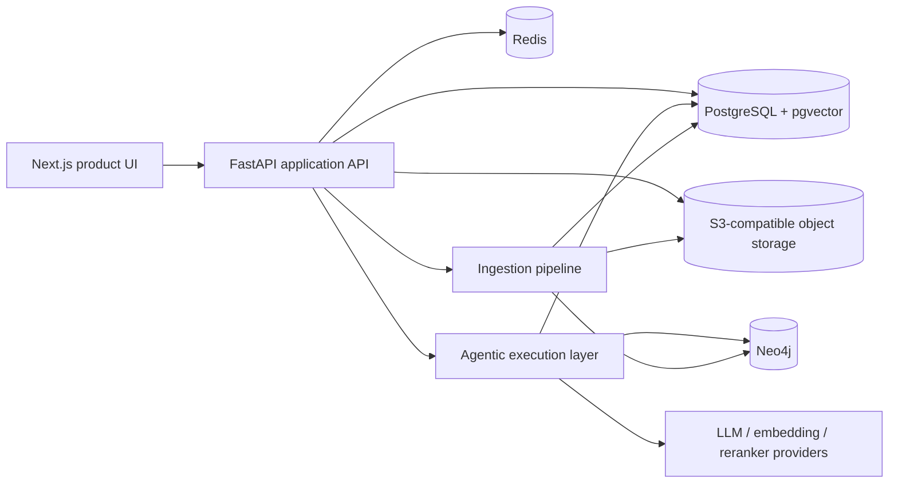

<div align="center">

# Mnemos

### Asset-centric industrial knowledge intelligence

Mnemos turns plant documents, maintenance history, operational events, compliance evidence, and expert knowledge into a governed operating memory for reliability and operations teams.

</div>

---

## Product direction

Industrial organizations usually have the information needed to investigate failures and demonstrate compliance, but that information is fragmented across manuals, procedures, work orders, inspection reports, shift logs, spreadsheets, incident records, and experienced personnel.

Mnemos organizes that information around the **asset and its operational history**. It combines document intelligence, vector retrieval, graph relationships, governed workflows, and evidence-linked answers without trying to replace the CMMS, EAM, QMS, or historian systems that already own transactional plant data.

The product is designed around five principles:

1. **Evidence before assertion** — answers expose citations, contradictions, confidence, and missing evidence.
2. **Assets before chat sessions** — the core context is the physical asset, its events, and its records.
3. **Governance before automation** — RCA closure, compliance review, and expert-knowledge approval remain human-controlled.
4. **Bounded agent responsibility** — the agentic layer retrieves and reasons; the backend validates and persists application state.
5. **Operational usability** — implementation depth is documented separately so the main workflows remain understandable to plant users.

## Current capabilities

### Product and frontend

- Public product landing page and technical documentation experience
- Auth entry screens with client-side validation, ready for backend integration
- Operational dashboard with overview, assets, asset passport, investigations, compliance, graph, documents, and expert knowledge
- Evidence drawers, confidence indicators, missing-evidence states, and asset-centric navigation
- Responsive SVG system, ingestion, agentic, and governance diagrams

### Backend application

- FastAPI application with versioned API routes
- JWT access tokens, rotating refresh tokens, password hashing, lockout controls, and development-login gating
- Organisation, membership, site, and role-based access checks
- Asset, alias, relationship, timeline, and graph endpoints
- Document upload sessions, storage handoff, ingestion runs, progress events, and retry controls
- Asynchronous query lifecycle with idempotency, cancellation, retry, claims, citations, and run metadata
- Governed RCA, compliance, and expert-knowledge workflows
- Audit events, request IDs, structured errors, security headers, request-size limits, and Redis-backed rate limiting

### Agentic and knowledge layer

- LangGraph-style workflow orchestration
- Query classification and route-specific retrieval planning
- Entity resolution with site-aware aliases and OCR-tolerant normalization
- Vector retrieval through PostgreSQL and pgvector
- Graph traversal and evidence-region mapping through Neo4j
- Reranking, evidence verification, contradiction handling, and structured result contracts
- Document ingestion pipeline for parsing, chunking, embeddings, entity extraction, and provenance
- Evaluation scaffolding for retrieval and answer-quality metrics

## Architecture



### Ownership boundary

```text
Frontend
  → requests product actions from the backend

Backend
  → authenticates and authorizes
  → owns application records and workflow state
  → validates agent output
  → persists claims, citations, status, and audit events

Agentic layer
  → performs retrieval and reasoning
  → returns a structured result
  → does not directly own backend business-state persistence
```

## Repository structure

```text
Mnemos/
├── frontend/                   # Next.js App Router product UI and documentation
├── src/mnemos/
│   ├── agentic/               # orchestration, retrieval, prompts, evaluation
│   ├── api/v1/                # FastAPI route modules
│   ├── core/                  # configuration, auth, DB, middleware, logging
│   ├── integrations/          # agent, ingestion, and storage gateways
│   ├── models/                # relational and vector models
│   ├── schemas/               # request, response, and agent contracts
│   └── services/              # application and workflow services
├── alembic/versions/          # schema migrations, including pgvector tables
├── tests/                     # backend unit and integration tests
├── scripts/                   # seed and container entrypoint scripts
├── deploy/gcp/                # Terraform for the GCP deployment path
├── .github/workflows/         # backend CI and manual GCP deployment workflows
├── docker-compose.yml         # local PostgreSQL, Neo4j, Redis, MinIO, API
└── docker-compose.production.yml
```

## Local development

### Prerequisites

- Python 3.12 recommended
- Node.js 20+
- Docker Desktop with Docker Compose
- Git

### 1. Configure the backend

```bash
cp .env.example .env
```

For Windows PowerShell:

```powershell
Copy-Item .env.example .env
```

The example file contains the supported database, Redis, object-storage, JWT, agent, ingestion, and provider settings. Replace development defaults before using any non-local environment.

### 2. Run the backend stack

```bash
docker compose up --build
```

The local stack starts:

| Service | Address |
|---|---|
| API | `http://localhost:8000` |
| API documentation | `http://localhost:8000/docs` |
| PostgreSQL + pgvector | `localhost:5432` |
| Neo4j browser | `http://localhost:7474` |
| Redis | `localhost:6379` |
| MinIO API | `http://localhost:9000` |
| MinIO console | `http://localhost:9001` |

Local Compose credentials are development-only and must not be reused for deployment.

### 3. Run the frontend

```bash
cd frontend
npm install
npm run dev
```

Open `http://localhost:3000`.

Important routes:

```text
/                         public product page
/documentation            technical overview
/documentation/agentic    agentic orchestration
/documentation/ingestion  ingestion and provenance
/documentation/retrieval  hybrid retrieval design
/documentation/infrastructure production topology
/dashboard                operational product dashboard
/signin                   unified authentication entry
/signup                   unified authentication entry, account mode
/about                    product direction and team responsibilities
```

## Running the backend without Docker

```bash
python -m venv .venv
```

Windows PowerShell:

```powershell
.\.venv\Scripts\Activate.ps1
python -m pip install --upgrade pip
pip install -e ".[dev]"
alembic upgrade head
python scripts/seed.py
uvicorn mnemos.main:app --reload --port 8000
```

macOS or Linux:

```bash
source .venv/bin/activate
python -m pip install --upgrade pip
pip install -e ".[dev]"
alembic upgrade head
python scripts/seed.py
uvicorn mnemos.main:app --reload --port 8000
```

## Tests and CI

Backend validation:

```bash
ruff check src tests scripts
python -m compileall -q src scripts
pytest -q
```

Frontend validation:

```bash
cd frontend
npm run build
```

The backend CI workflow runs linting, compilation, tests, migration upgrade/downgrade validation on a pgvector-enabled PostgreSQL service, and a Docker image build. GCP deployment is manual and requires the configured GitHub environment variables and workload-identity secrets.

## Security model

Implemented controls include:

- short-lived JWT access tokens with issuer, audience, token type, and token-version checks
- hashed refresh-token rotation and revocation
- password strength validation and temporary account lockout
- role- and site-scoped authorization
- rate limiting with production fail-closed behavior
- strict Pydantic request models and unknown-field rejection
- request-size limits and security response headers
- normalized public errors without raw exception leakage
- idempotency records for query and ingestion mutations
- citation and evidence-region scope validation
- production checks against weak secrets, wildcard CORS, and default storage credentials

The current frontend authentication forms are presentation and validation surfaces; the next integration phase connects them to the backend token lifecycle.

## Evaluation direction

Mnemos is intended to be evaluated at three levels:

| Area | Example measures |
|---|---|
| Retrieval | Recall@K, MRR, nDCG, context precision |
| Grounding | citation validity, claim support, contradiction detection, abstention quality |
| Product reliability | authorization isolation, workflow correctness, latency, retries, and error recovery |

The synthetic demonstration corpus includes recurring P-117 seal failures, duplicate asset tags across sites, superseded procedures, contradictory records, restricted documents, expert notes, and missing-evidence cases.

## Project team

- **Dhruv Gupta** — backend, integration, infrastructure, deployment, and system reliability
- **Pavit Aggarwal** — agentic orchestration, retrieval, graph intelligence, and evaluation
- **Akshhaya** — frontend, UI/UX, and operational product experience

## Current status

The backend foundation, agentic architecture, public frontend, dashboard prototype, and technical documentation are present. The active work now is frontend–backend integration, real ingestion validation, provider configuration, full-system evaluation, and final deployment hardening.
