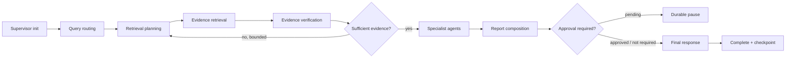

<div align="center">

# Mnemos

### Industrial knowledge intelligence built around the asset

Evidence-grounded operational memory for maintenance, reliability, safety, quality, and compliance teams.

[](https://mnemos-lake.vercel.app)
[](pyproject.toml)
[](frontend)
[](docs/retrieval.md)
[](LICENSE)

</div>

---

## Overview

Industrial knowledge is rarely absent; it is fragmented. Manuals, work orders, inspection records, procedures, shift notes, compliance evidence, and expert observations often live in separate systems with inconsistent identifiers and revision histories.

Mnemos organises that information around physical assets and their operational timelines. It combines hybrid retrieval, governed multi-agent investigation, durable workflow state, evidence provenance, and a responsive operational dashboard.

The system is designed for questions such as:

- What evidence supports the suspected cause of a recurring failure?
- Which current procedure applies to this asset configuration?
- Where are compliance requirements missing valid evidence?
- Has the same failure pattern appeared on related assets?
- What is known, contradicted, stale, or still missing?

Mnemos complements CMMS, EAM, QMS, and document-management systems. It acts as an evidence and reasoning layer rather than replacing the source systems that own operational records.

## Product surface

| Area | Purpose |
|---|---|
| Plant overview | Operational indicators, high-risk assets, evidence gaps, and recent activity |
| Asset passport | Timeline, evidence, claims, missing evidence, graph context, and actions |
| Investigation workspace | RCA timeline, hypotheses, supporting/opposing evidence, diagnostics, and actions |
| Compliance matrix | Requirement-to-asset evidence mapping, validity, gaps, and review status |
| Knowledge graph | Interactive asset, finding, document, procedure, and knowledge relationships |
| Documents | Version-aware source library and indexed evidence reading surface |
| Expert knowledge | Attributed, reviewable operational recommendations outside formal procedures |
| Query workspace | Natural-language investigation entry point and evidence-backed responses |
| Agentic trace | Stage-by-stage execution, timing, evidence, and missing-information disclosure |
| Results | Searchable completed analyses with confidence and citations |
| Organisation | Authenticated workspace, membership, account, and destructive-action controls |

The public deployment includes a synthetic, read-only demonstration dataset. Authentication is required for private workspace data and mutating operations.

## Architecture


### Investigation flow



The reflection loop is bounded. Critical actions are not silently auto-approved. Checkpoints, audit entries, investigation events, approval requests, and idempotency markers are persisted in PostgreSQL.

## Retrieval and evidence

Mnemos combines multiple retrieval strategies because industrial questions often contain both semantic meaning and exact identifiers:

1. vector retrieval through pgvector;
2. lexical retrieval for equipment tags, part numbers, and procedure codes;
3. structured retrieval for temporal, numeric, and status constraints;
4. graph retrieval for asset and evidence relationships;
5. bounded multi-hop retrieval for indirect operational context;
6. reranking, deduplication, and token-budget control;
7. provenance verification, contradiction detection, and confidence scoring.

Every material claim is expected to carry source provenance. When evidence is insufficient, the runtime identifies missing evidence or abstains rather than fabricating certainty.

## Governed agent execution

Specialised agents operate with:

- intent-selective dispatch;
- per-agent tool allowlists;
- tenant, site, asset, and document scope propagation;
- bounded tool-call budgets and timeouts;
- structured tool trajectories;
- scope-violation and duplicate-call evaluation;
- approval gates for governed decisions;
- durable checkpoint and resume behaviour.

The package named `agentic/mcp` is an **internal governed tool-dispatch layer**. It does not claim protocol-level compatibility with the external Model Context Protocol specification.

## Evaluation results

The checked-in deterministic evaluation dataset provides a reproducible regression baseline without requiring a live model or database.

| Metric | Score |
|---|---:|
| Overall weighted score | **0.8438** |
| Routing accuracy | **1.0000** |
| Retrieval recall | **1.0000** |
| Citation precision | **0.9167** |
| Grounded-answer rate | **1.0000** |
| Abstention quality | **0.9375** |
| Tool recovery | **1.0000** |
| Workflow completion | **1.0000** |

These scores measure deterministic pipeline behaviour and regression resistance; they are not presented as production model accuracy. Provider-backed RAGAS support exists for answer relevance, context precision, context recall, and faithfulness, but no aggregate RAGAS score is published without a pinned corpus, model pair, retrieval configuration, and retained run artefact.

The automated suite covers unit, service, API contract, runtime durability, approval governance, scope isolation, end-to-end query behaviour, tool selection, degraded-provider handling, and deployment configuration. See [Testing and evaluation](docs/testing-and-evaluation.md) for methodology and interpretation.

## Repository layout

```text
.
├── frontend/                       # Next.js dashboard and server-side API proxy
├── src/mnemos/
│   ├── agentic/                    # Agents, retrieval, evaluation, runtime, governed tools
│   ├── api/                        # FastAPI routers and dependencies
│   ├── core/                       # Configuration, DB, middleware, logging, security
│   ├── integrations/               # Agent and ingestion gateway adapters
│   ├── models/                     # SQLAlchemy entities and vector models
│   ├── schemas/                    # API contracts
│   └── services/                   # Application services and query persistence
├── alembic/                        # Database migrations
├── scripts/                        # Entrypoints, seed, and operational utilities
├── tests/                          # Project-level regression and contract tests
├── docs/                           # Engineering documentation and ADRs
├── Dockerfile
├── docker-compose.yml
├── render.yaml
└── pyproject.toml
```

## Technology

| Area | Implementation |
|---|---|
| Frontend | Next.js 16, React 19, Tailwind CSS 3, Cytoscape.js |
| API | FastAPI, Pydantic v2, ORJSON |
| Persistence | SQLAlchemy 2 async, PostgreSQL, Alembic |
| Vector search | pgvector |
| Graph | Neo4j-compatible driver |
| Cache and rate limiting | Redis |
| Object storage | S3-compatible API |
| Agent orchestration | LangGraph-based canonical runtime |
| Observability | Structured JSON logging and OpenTelemetry hooks |
| Testing | pytest, pytest-asyncio, deterministic evaluation gates |
| Deployment | Docker-based API and serverless-compatible frontend |

## Local development

### Prerequisites

- Python 3.12
- Node.js 20+
- Docker Desktop with Docker Compose
- Git

### Configure

```bash
cp .env.example .env
cp frontend/.env.example frontend/.env.local
```

Never commit environment files, provider keys, database URLs, or exported private data.

### Start infrastructure

```bash
docker compose up -d postgres redis minio neo4j
```

Neo4j can be disabled with `NEO4J_ENABLED=false` when graph retrieval is not under test.

### Backend

Windows Command Prompt:

```cmd
python -m venv .venv
call .venv\Scripts\activate.bat
python -m pip install --upgrade pip setuptools wheel
python -m pip install -e ".[dev]"
alembic upgrade head
python -m uvicorn mnemos.main:app --host 0.0.0.0 --port 8000 --reload
```

macOS / Linux:

```bash
python -m venv .venv
source .venv/bin/activate
python -m pip install --upgrade pip setuptools wheel
python -m pip install -e '.[dev]'
alembic upgrade head
python -m uvicorn mnemos.main:app --host 0.0.0.0 --port 8000 --reload
```

### Frontend

```bash
cd frontend
npm ci
npm run dev
```

### Demonstration data

```bash
python scripts/seed.py
```

Set `SEED_DEFAULT_PASSWORD` locally before running the seed command.

## Documentation

Start with the [documentation index](docs/README.md).

- [Architecture](docs/architecture.md)
- [Data model](docs/data-model.md)
- [Agent runtime](docs/agent-runtime.md)
- [Retrieval](docs/retrieval.md)
- [Security](docs/security.md)
- [Operations](docs/operations.md)
- [Deployment](docs/deployment.md)
- [Testing and evaluation](docs/testing-and-evaluation.md)
- [Public demonstration](docs/public-demo.md)
- [Architecture decisions](docs/decisions/README.md)

## Contributing

Issues and pull requests are welcome. Read [CONTRIBUTING.md](CONTRIBUTING.md) before proposing substantial changes. Security concerns should follow [SECURITY.md](SECURITY.md) rather than being opened publicly.

## License

Licensed under the [Apache License 2.0](LICENSE). Reuse and redistribution are permitted under its terms; copyright, licence, and attribution notices must be preserved. See [NOTICE](NOTICE) for project attribution.

---

<div align="center">

**Mnemos — operational memory built around the asset and grounded in evidence.**

</div>
