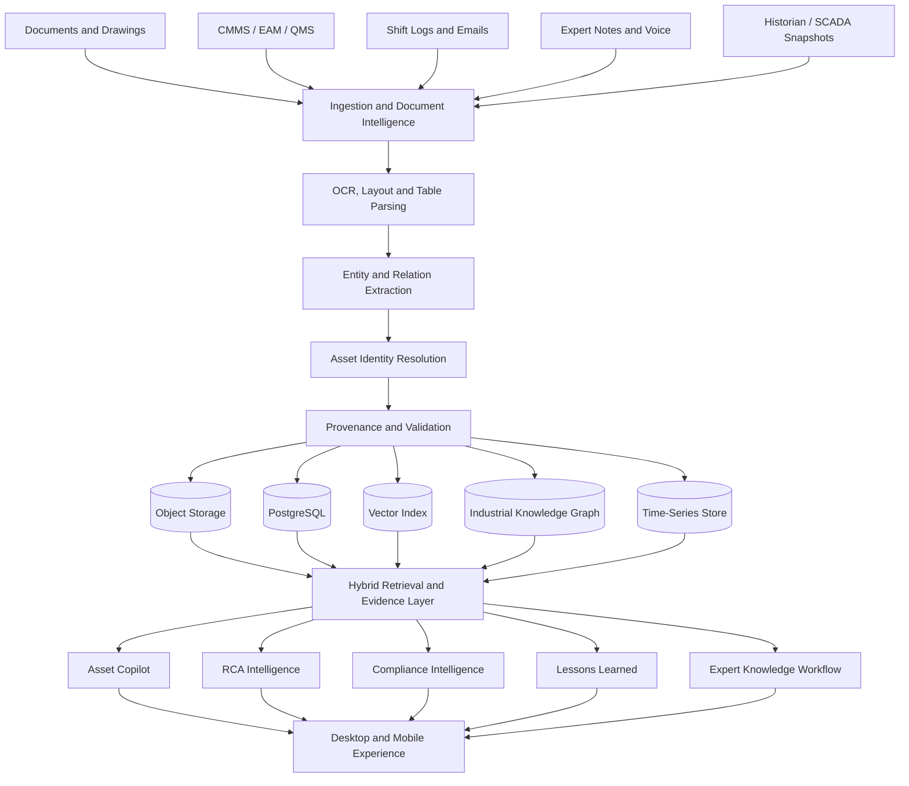
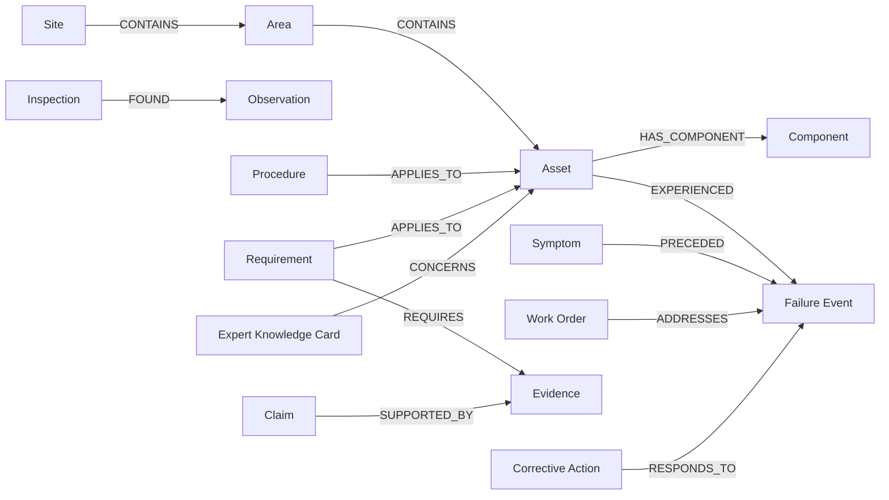
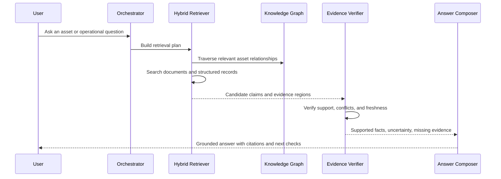

<div align="center">

# Mnemos

### Industrial Knowledge Intelligence for Asset-Centric Operations

**Evidence-grounded operational memory for maintenance, reliability, safety, quality, and compliance teams.**

[](#)
[](#)
[](#)
[](#)
[](#)

</div>

---

## Overview

Industrial knowledge is rarely absent. It is fragmented across P&IDs, OEM manuals, work orders, shift logs, inspection reports, procedures, incident records, spreadsheets, emails, and the experience of senior personnel.

**Mnemos** converts these disconnected sources into a living, time-aware operational memory centred on industrial assets. It connects assets, events, symptoms, failures, procedures, inspections, requirements, corrective actions, and expert knowledge—then exposes that context through evidence-grounded retrieval and governed workflows.

Mnemos is not a document chatbot or a CMMS replacement. Its primary unit of intelligence is the **asset and its operational history**.

## Core capabilities

- **Heterogeneous ingestion** — native and scanned PDFs, drawings, spreadsheets, work-order exports, inspection records, emails, images, and field notes.
- **Industrial knowledge graph** — asset, component, event, failure, procedure, evidence, requirement, and expert-knowledge relationships.
- **Hybrid retrieval** — semantic retrieval, metadata filtering, graph traversal, structured queries, and reranking.
- **Evidence-grounded copilot** — claim-level citations, confidence, contradictions, missing evidence, and abstention.
- **RCA workspace** — timelines, observed facts, hypotheses, similar failures, rejected causes, diagnostics, and corrective actions.
- **Compliance intelligence** — requirement-to-evidence mapping, validity checks, expiry tracking, contradiction detection, and audit packages.
- **Lessons learned** — recurrence detection across failures, incidents, near misses, non-conformances, and ineffective actions.
- **Field mode** — asset scanning, current procedures, failure history, hazards, open work, and evidence capture.
- **Expert memory** — attributed, reviewable, versioned knowledge cards that cannot silently override approved procedures.

## System architecture



## Knowledge model



Every material fact and relationship carries source provenance, confidence, verification status, temporal validity, and reviewer history.

## How an answer is produced



## Technology stack

| Layer | Technology |
|---|---|
| Web application | Next.js, TypeScript |
| API services | FastAPI, Python |
| Agent orchestration | LangGraph or equivalent state-machine workflow |
| Relational store | PostgreSQL |
| Vector retrieval | pgvector initially; Qdrant at larger scale |
| Knowledge graph | Neo4j |
| Object storage | MinIO or S3-compatible storage |
| Time-series | TimescaleDB |
| Document processing | Docling, Unstructured, PaddleOCR, custom parsers |
| Background processing | Celery, Dramatiq, or Temporal |
| Graph visualisation | Cytoscape.js or React Flow |
| Deployment | Docker Compose; Kubernetes-ready service boundaries |

## Repository structure

```text
mnemos/
├── apps/
│   ├── web/                 # Next.js operations and field interface
│   └── api/                 # FastAPI application
├── services/
│   ├── ingestion/           # Parsing, OCR, extraction, provenance
│   ├── retrieval/           # Hybrid search and reranking
│   ├── graph/               # Ontology, identity resolution, graph writes
│   └── agents/              # RCA, compliance, lessons, copilot workflows
├── packages/
│   ├── contracts/           # Shared schemas and API contracts
│   └── ui/                  # Shared interface components
├── infrastructure/
│   ├── docker/
│   └── migrations/
├── datasets/
│   ├── synthetic-plant/
│   └── evaluation/
├── docs/
├── tests/
├── docker-compose.yml
├── .env.example
└── README.md
```

## Local setup

### Prerequisites

- Git
- Docker Desktop with Docker Compose
- Node.js 20+
- Python 3.11+
- `pnpm`
- An LLM endpoint configured through environment variables

### Clone and configure

```bash
git clone https://github.com/Dhruvg334/mnemos.git
cd mnemos

cp .env.example .env
```

Configure the required model, database, storage, and authentication values in `.env`.

### Run with Docker Compose

```bash
docker compose up --build
```

Expected local services:

```text
Web application    http://localhost:3000
API documentation  http://localhost:8000/docs
Neo4j browser      http://localhost:7474
MinIO console      http://localhost:9001
```

### Run services separately

Frontend:

```bash
cd apps/web
pnpm install
pnpm dev
```

Backend:

```bash
cd apps/api
python -m venv .venv

# Windows PowerShell
.venv\Scripts\Activate.ps1

# macOS / Linux
source .venv/bin/activate

pip install -r requirements.txt
uvicorn app.main:app --reload --port 8000
```

### Database migrations

```bash
cd apps/api
alembic upgrade head
```

### Load the synthetic demonstration dataset

```bash
python scripts/seed_demo_data.py
python scripts/ingest_demo_corpus.py
```

### Run tests

```bash
pytest
pnpm --dir apps/web test
```

## Evaluation

Mnemos is evaluated against explicit, reproducible criteria:

| Area | Metric |
|---|---|
| Document intelligence | entity and relation extraction precision, recall, and F1 |
| Retrieval | answer relevance, retrieval recall, citation precision |
| Evidence quality | claim-to-source support and contradiction detection |
| Graph quality | identity-resolution accuracy and relationship completeness |
| RCA | chronology quality, evidence coverage, and missing-diagnostic detection |
| Compliance | requirement applicability and evidence-gap detection accuracy |
| Safety | abstention quality and unsupported-claim rate |
| Operational value | time-to-answer compared with manual document search |

## Security and governance

- Role- and site-aware access control before retrieval.
- Tenant and site boundaries on every persisted entity.
- Encryption in transit and at rest.
- Immutable audit records for ingestion, retrieval, agent actions, review, and approval.
- Human approval for RCA closure, compliance decisions, and expert-knowledge validation.
- Private-cloud, on-premise, and local-model deployment paths.
- No autonomous plant control or maintenance approval.

## Differentiation

Most knowledge systems follow:

```text
Document → Chunk → Answer
```

Mnemos follows:

```text
Asset → Event → Evidence → Relationship → Operational Decision
```

Its defensibility comes from the validated operational memory accumulated over time: plant-specific ontology, resolved asset identities, reviewed relationships, failure patterns, requirement-evidence mappings, and governed expert knowledge.

## Status

Mnemos is under active development for the ET AI Hackathon 2026 problem statement on Industrial Knowledge Intelligence.

---

<div align="center">

**Mnemos — operational memory built around the asset, grounded in evidence.**

</div>
