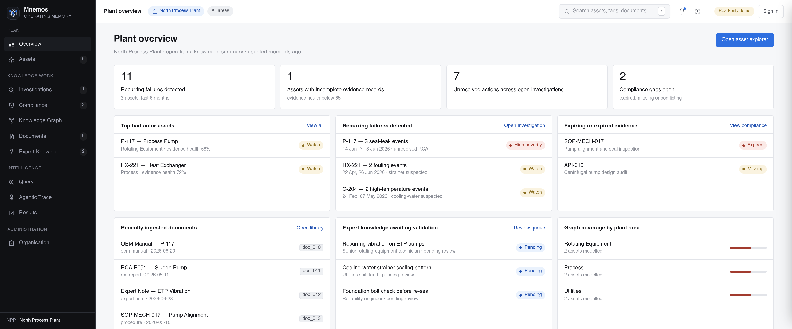
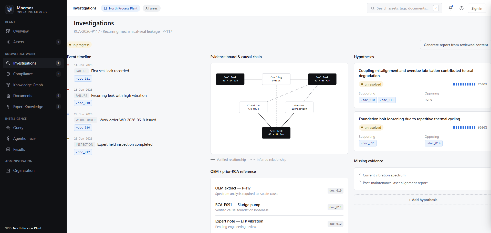
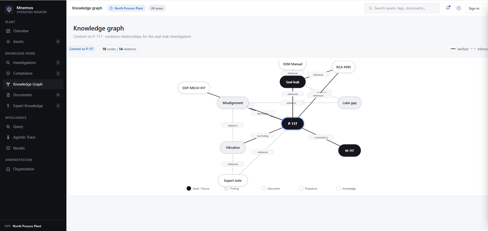
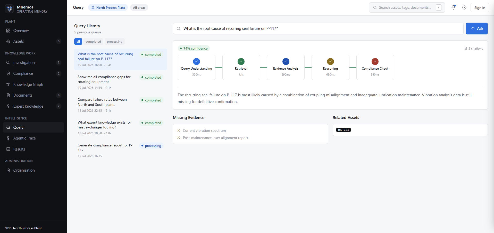
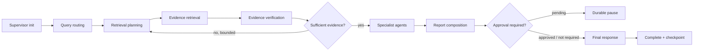

<div align="center">

# Mnemos

### Industrial knowledge intelligence built around the asset

Evidence-grounded operational memory for maintenance, reliability, safety, quality, and compliance teams.

[](https://mnemos-lake.vercel.app)
[](pyproject.toml)
[](frontend)
[](docs/retrieval.md)
[](LICENSE)

</div>

---

## Overview

Industrial knowledge is rarely absent; it is fragmented. Manuals, work orders, inspection records, procedures, shift notes, compliance evidence, and expert observations often live in separate systems with inconsistent identifiers and revision histories.

Mnemos organises that information around physical assets and their operational timelines. It combines hybrid retrieval, governed multi-agent investigation, durable workflow state, evidence provenance, and a responsive operational dashboard.

The system is designed for questions such as:

- What evidence supports the suspected cause of a recurring failure?
- Which current procedure applies to this asset configuration?
- Where are compliance requirements missing valid evidence?
- Has the same failure pattern appeared on related assets?
- What is known, contradicted, stale, or still missing?

Mnemos complements CMMS, EAM, QMS, and document-management systems. It acts as an evidence and reasoning layer rather than replacing the source systems that own operational records.

## Why this problem matters

Industrial maintenance knowledge is difficult to reuse because the evidence is split across structured work orders, unstructured reports, revision-controlled procedures, asset hierarchies, and expert observations. Research on maintenance knowledge graphs repeatedly identifies the same operational gap: fault history contains useful causal and diagnostic knowledge, but conventional systems make it difficult to search, connect, and reuse that knowledge for root-cause analysis and failure prevention.

Mnemos is designed around the consequences of that fragmentation:

- **Asset identity is inconsistent.** Equipment tags, aliases, parent-child relationships, and site scope must be resolved before retrieval can be trusted.
- **Time and revision matter.** A technically relevant procedure may still be unsafe to cite when it has expired or been superseded.
- **A fluent answer is not enough.** Reliability and compliance teams need claims linked to source regions, contradiction handling, and explicit missing evidence.
- **Multi-agent orchestration needs controls.** Specialist agents are useful only when their tool access, scope, retries, and approval boundaries are measurable.
- **Operational workflows outlive web requests.** Checkpoints, audit entries, approval pauses, and idempotency markers must survive process restarts.

The architecture therefore combines relational state, vector and lexical retrieval, graph context, evidence provenance, deterministic policy checks, and durable workflow execution instead of treating the problem as document chat.

## Product surface

| Area | Purpose |
|---|---|
| Plant overview | Operational indicators, high-risk assets, evidence gaps, and recent activity |
| Asset passport | Timeline, evidence, claims, missing evidence, graph context, and actions |
| Investigation workspace | RCA timeline, hypotheses, supporting/opposing evidence, diagnostics, and actions |
| Compliance matrix | Requirement-to-asset evidence mapping, validity, gaps, and review status |
| Knowledge graph | Interactive asset, finding, document, procedure, and knowledge relationships |
| Documents | Version-aware source library and indexed evidence reading surface |
| Expert knowledge | Attributed, reviewable operational recommendations outside formal procedures |
| Query workspace | Natural-language investigation entry point and evidence-backed responses |
| Agentic trace | Stage-by-stage execution, timing, evidence, and missing-information disclosure |
| Results | Searchable completed analyses with confidence and citations |
| Organisation | Authenticated workspace, membership, account, and destructive-action controls |

The public deployment includes a synthetic, read-only demonstration dataset. Authentication is required for private workspace data and mutating operations.

## Product tour

<table>
  <tr>
    <td width="50%"></td>
    <td width="50%"></td>
  </tr>
  <tr>
    <td align="center"><b>Operational overview</b><br/>Risk, evidence health, compliance gaps, and recent activity.</td>
    <td align="center"><b>Investigation workspace</b><br/>Timelines, hypotheses, missing evidence, and recommended actions.</td>
  </tr>
  <tr>
    <td width="50%"></td>
    <td width="50%"></td>
  </tr>
  <tr>
    <td align="center"><b>Knowledge graph</b><br/>Asset, document, finding, procedure, and expert-knowledge relationships.</td>
    <td align="center"><b>Query workspace</b><br/>Pipeline stages, confidence, citations, and disclosed evidence gaps.</td>
  </tr>
</table>

The full screenshot set is indexed in [`docs/screenshots`](docs/screenshots/README.md).

## Architecture


### Investigation flow



The reflection loop is bounded. Critical actions are not silently auto-approved. Checkpoints, audit entries, investigation events, approval requests, and idempotency markers are persisted in PostgreSQL.

## Retrieval and evidence

Mnemos combines multiple retrieval strategies because industrial questions often contain both semantic meaning and exact identifiers:

1. vector retrieval through pgvector;
2. lexical retrieval for equipment tags, part numbers, and procedure codes;
3. structured retrieval for temporal, numeric, and status constraints;
4. graph retrieval for asset and evidence relationships;
5. bounded multi-hop retrieval for indirect operational context;
6. reranking, deduplication, and token-budget control;
7. provenance verification, contradiction detection, and confidence scoring.

Every material claim is expected to carry source provenance. When evidence is insufficient, the runtime identifies missing evidence or abstains rather than fabricating certainty.

## Governed agent execution

Specialised agents operate with:

- intent-selective dispatch;
- per-agent tool allowlists;
- tenant, site, asset, and document scope propagation;
- bounded tool-call budgets and timeouts;
- structured tool trajectories;
- scope-violation and duplicate-call evaluation;
- approval gates for governed decisions;
- durable checkpoint and resume behaviour.

The package named `agentic/mcp` is an **internal governed tool-dispatch layer**. It does not claim protocol-level compatibility with the external Model Context Protocol specification.

## Engineering characteristics

| Concern | Design response |
|---|---|
| Tenant isolation | Organisation and site membership are re-resolved at execution boundaries; agent tools receive explicit scope rather than ambient database access. |
| Evidence provenance | Claims and citations retain document, version, page/region, and retrieval metadata wherever the source model provides it. |
| Retrieval diversity | Vector, lexical, structured, graph, and bounded multi-hop strategies are fused and reranked rather than relying on one similarity score. |
| Failure recovery | Runtime checkpoints, audit records, investigation events, approval requests, and node-completion markers are persisted in PostgreSQL. |
| Human authority | Governed decisions can pause durably and resume only after an authorised approval decision; requester/reviewer separation is enforced. |
| Tool governance | Tool allowlists, per-agent budgets, timeouts, duplicate-call checks, scope checks, and trajectories constrain agent behaviour. |
| Degraded dependencies | Optional graph and reranker services can fail without taking down liveness; readiness and diagnostic endpoints expose the degradation. |
| Public access | The demonstration workspace is read-only; backend authorisation remains the control for mutations and private data. |

## Evaluation results

The checked-in deterministic evaluation dataset provides a reproducible regression baseline without requiring a live model or database.

| Metric | Score |
|---|---:|
| Overall weighted score | **0.8438** |
| Weighted evaluation score | **0.8438** |
| Citation precision | **0.9167** |
| Citation precision | **0.9167** |
| Abstention quality | **0.9375** |
| Abstention quality | **0.9375** |


These scores measure deterministic pipeline behaviour and regression resistance; they are not presented as production model accuracy. Provider-backed RAGAS support exists for answer relevance, context precision, context recall, and faithfulness, but no aggregate RAGAS score is published without a pinned corpus, model pair, retrieval configuration, and retained run artefact.

The automated suite covers unit, service, API contract, runtime durability, approval governance, scope isolation, end-to-end query behaviour, tool selection, degraded-provider handling, and deployment configuration. See [Testing and evaluation](docs/testing-and-evaluation.md) for methodology and interpretation.

## Repository layout

```text
.
├── frontend/                       # Next.js dashboard and server-side API proxy
├── src/mnemos/
│   ├── agentic/                    # Agents, retrieval, evaluation, runtime, governed tools
│   ├── api/                        # FastAPI routers and dependencies
│   ├── core/                       # Configuration, DB, middleware, logging, security
│   ├── integrations/               # Agent and ingestion gateway adapters
│   ├── models/                     # SQLAlchemy entities and vector models
│   ├── schemas/                    # API contracts
│   └── services/                   # Application services and query persistence
├── alembic/                        # Database migrations
├── scripts/                        # Entrypoints, seed, and operational utilities
├── tests/                          # Project-level regression and contract tests
├── docs/                           # Engineering documentation and ADRs
├── Dockerfile
├── docker-compose.yml
├── render.yaml
└── pyproject.toml
```

## Technology

| Area | Implementation |
|---|---|
| Frontend | Next.js 16, React 19, Tailwind CSS 3, Cytoscape.js |
| API | FastAPI, Pydantic v2, ORJSON |
| Persistence | SQLAlchemy 2 async, PostgreSQL, Alembic |
| Vector search | pgvector |
| Graph | Neo4j-compatible driver |
| Cache and rate limiting | Redis |
| Object storage | S3-compatible API |
| Agent orchestration | LangGraph-based canonical runtime |
| Observability | Structured JSON logging and OpenTelemetry hooks |
| Testing | pytest, pytest-asyncio, deterministic evaluation gates |
| Deployment | Docker-based API and serverless-compatible frontend |

## Local development

### Prerequisites

- Python 3.12
- Node.js 20+
- Docker Desktop with Docker Compose
- Git

### Configure

```bash
cp .env.example .env
cp frontend/.env.example frontend/.env.local
```

Never commit environment files, provider keys, database URLs, or exported private data.

### Start infrastructure

```bash
docker compose up -d postgres redis minio neo4j
```

Neo4j can be disabled with `NEO4J_ENABLED=false` when graph retrieval is not under test.

### Backend

Windows Command Prompt:

```cmd
python -m venv .venv
call .venv\Scripts\activate.bat
python -m pip install --upgrade pip setuptools wheel
python -m pip install -e ".[dev]"
alembic upgrade head
python -m uvicorn mnemos.main:app --host 0.0.0.0 --port 8000 --reload
```

macOS / Linux:

```bash
python -m venv .venv
source .venv/bin/activate
python -m pip install --upgrade pip setuptools wheel
python -m pip install -e '.[dev]'
alembic upgrade head
python -m uvicorn mnemos.main:app --host 0.0.0.0 --port 8000 --reload
```

### Frontend

```bash
cd frontend
npm ci
npm run dev
```

### Demonstration data

```bash
python scripts/seed.py
```

Set `SEED_DEFAULT_PASSWORD` locally before running the seed command.

## Documentation

Start with the [documentation index](docs/README.md).

- [Architecture](docs/architecture.md)
- [Data model](docs/data-model.md)
- [Agent runtime](docs/agent-runtime.md)
- [Retrieval](docs/retrieval.md)
- [Security](docs/security.md)
- [Operations](docs/operations.md)
- [Deployment](docs/deployment.md)
- [Testing and evaluation](docs/testing-and-evaluation.md)
- [Public demonstration](docs/public-demo.md)
- [Architecture decisions](docs/decisions/README.md)

## Contributing

Issues and pull requests are welcome. Read [CONTRIBUTING.md](CONTRIBUTING.md) before proposing substantial changes. Security concerns should follow [SECURITY.md](SECURITY.md) rather than being opened publicly.

## License

Licensed under the [Apache License 2.0](LICENSE). Reuse and redistribution are permitted under its terms; copyright, licence, and attribution notices must be preserved. See [NOTICE](NOTICE) for project attribution.

---

<div align="center">

**Mnemos — operational memory built around the asset and grounded in evidence.**

</div>


## Technical references

- Neo4j knowledge-graph research for industrial root-cause analysis: [Procedia Computer Science, 2022](https://doi.org/10.1016/j.procs.2022.01.303)
- Maintenance work-order knowledge extraction and reuse: [KNOWO](https://doi.org/10.1016/j.compind.2022.103824)
- RAG evaluation dimensions: [Ragas metrics](https://docs.ragas.io/en/latest/concepts/metrics/available_metrics/)
- Neo4j Python driver connection guidance: [Neo4j documentation](https://neo4j.com/docs/python-manual/current/connect/)
