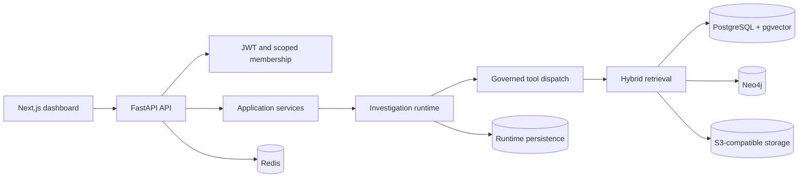

# Architecture

Mnemos is an asset-centred industrial knowledge system. It connects operational records, retrieval, governed reasoning, and review workflows without treating the language model as a source of truth.

## System boundaries

The frontend owns navigation, display state, and server-side API proxying. The API owns authentication, tenancy, persistence, and final application transactions. The agent runtime may produce findings, but it does not own user records or bypass application services.

## Query lifecycle

1. The API validates the authenticated principal and query scope.
2. The query service creates a durable query record and run metadata.
3. The orchestrator builds the canonical investigation pipeline.
4. Retrieval candidates are generated and verified before reasoning.
5. Specialist agents operate through scoped tools with bounded calls.
6. The final report carries claims, citations, confidence, and missing evidence.
7. Governed actions pause for human approval when required.
8. The backend persists the accepted result in one application transaction.

## Failure domains

PostgreSQL is the system of record and is required for durable operation. Redis, Neo4j, model providers, and object storage are separately observable dependencies. Optional dependency failure should degrade the affected capability, not cause unrelated API routes to fabricate success.

## Deployment shape

The repository supports containerised local development, a managed web-service deployment for the API, and a serverless-compatible Next.js frontend. Public documentation intentionally omits production hostnames and credentials.
