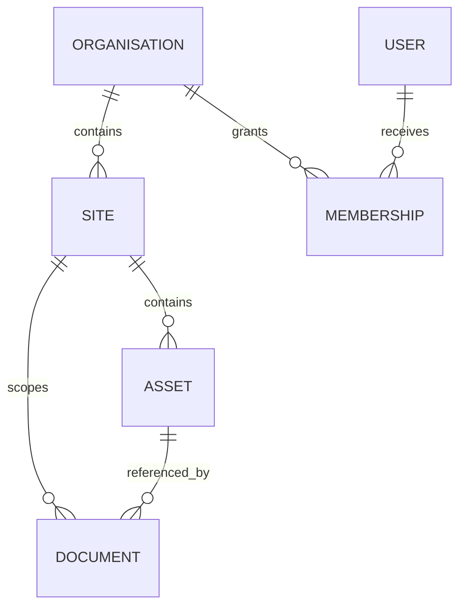

# Data model

## Tenancy hierarchy

A membership binds a user to an organisation and optionally a site. Application queries must preserve both boundaries. Organisation-wide roles may operate across sites only where explicitly permitted.

## Asset-centred memory

Assets are the stable anchor for timelines, documents, failures, work orders, compliance evidence, expert knowledge, and graph relationships. Documents remain versioned source records rather than becoming the primary knowledge unit.

## Evidence model

A claim links to citations. A citation resolves to an evidence region or document chunk and retains document, version, page, and asset scope where available. This separation allows the system to distinguish the generated statement from the source material that supports or contradicts it.

## Runtime persistence

Runtime checkpoints, audit entries, investigation events, approval requests, and idempotency markers are separate from final query records. This keeps workflow recovery concerns independent from application result ownership.

## Lifecycle rules

- Documents progress through upload, processing, ready, or failed states.
- Knowledge cards require review before being treated as approved guidance.
- Approval requests are immutable after a terminal decision.
- Refresh tokens and idempotency records have explicit expiry and revocation behaviour.
